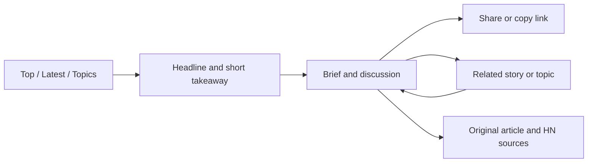

# Hacksnap UX and frontend review

Reviewed 26 September 2026. Scope: live homepage, a populated story, a topic listing and archive; desktop and narrow layouts; dark and light appearance; frontend source and shared styles. This is a heuristic review, not a user study. Engagement improvements below are hypotheses to validate. No product code was changed.

## Recommendation

Build the experience around a clear promise: **understand what changed in AI, why it matters to people building software, and where the evidence is contested.**

Hacksnap already has a coherent base palette and useful content. The main weaknesses are competing priorities within each page and missing connections between pages. The homepage emphasizes scores, ranking charts and sharing; the story page prioritizes another metrics panel before the brief; the end of the story provides no next read. Topic pages are discoverable through small badges, while a prominent navigation link leads off-site.

Keep the restrained visual character. Make editorial hierarchy and the browsing journey the first redesign work.

## 1. Audience and product promise

### Primary persona: the technically curious practitioner

An engineer, technical lead, researcher or builder who already sees plenty of AI announcements. This is a working persona inferred from the intended audience, not a researched demographic profile.

They arrive with four jobs:

1. **Catch up:** What changed since I last checked?
2. **Evaluate:** Is this useful, credible, relevant to my work, or mostly an announcement?
3. **Explore:** What related developments and disagreements should I understand?
4. **Share:** Can I send a colleague something useful with a defensible takeaway?

Support two reading speeds: a short scan and a deeper session. Longer visits should result from finding more worthwhile material. Track whether readers understand a story and choose another one, alongside engaged time and return visits.

### Resolve the coverage promise

The current identity is “AI on Hacker News,” and all six topics describe AI coverage. The requested audience also includes engineering news. A suitable initial position is **AI news for people who build software**. Broader coverage of databases, languages, systems and engineering practice would require broader content selection and taxonomy as well as new copy. Avoid promising that breadth through a headline alone.

Candidate homepage copy, subject to the coverage decision:

> AI news for people who build.
>
> The developments, practical implications, and arguments worth your time. From Hacker News.

## 2. Findings, ordered by likely user impact

### A. Reading is interrupted before it gets going — high priority

**Observed:** On the sampled desktop story at a measured 1280 × 800 viewport, the headline began at about 195px, the metrics panel at 732px, and “The brief” at 1448px. The metrics panel alone was about 679px tall. The takeaway is visible earlier, but its long paragraph is followed by sharing, source links and a large chart before the article brief.

**Why it matters:** Someone clicking for an explanation has to pass a substantial amount of supporting information. On narrow layouts, wrapping increases the burden.

**Change:** Put a short takeaway and the brief first. Follow with the discussion and its sources. Keep a compact skepticism label and coverage statement near the introduction; put ranking history lower down or behind a clearly labeled disclosure. Offer “Brief” and “Discussion” anchor links where the page is long.

Source: [story page](/Users/rafaelpierre/projects/lighthouse-hacker-news/hacksnap/web/app/story/[id]/page.tsx:39), [metrics styling](/Users/rafaelpierre/projects/lighthouse-hacker-news/hacksnap/web/app/globals.css:211).

### B. Finishing a story is a dead end — high priority

**Observed:** The article ends with generation and source-coverage information, followed by the site footer. There is no next story, related story or topic continuation. “All stories” at the top always links to `/`, even when a reader arrived from a topic or archive page.

**Change:** End every available brief with two or three useful next reads and a link to its topic. Start with recent stories from the same category, excluding the current story and preferring available summaries. Label that fallback honestly as “More in Safety & Privacy,” for example. Use a contextual return link that preserves the originating category, archive page and filters; retain a reliable home fallback for direct arrivals. Browser Back should restore list position.

**Later:** Connect stories about the same model, tool or ongoing event. That requires reliable relationship data; category membership alone does not establish a shared story.

Source: [story navigation and ending](/Users/rafaelpierre/projects/lighthouse-hacker-news/hacksnap/web/app/story/[id]/page.tsx:34).

### C. Discovery is hidden — high priority

**Observed:** Global navigation offers Archive and Hacker News. Categories can be reached through flairs, but there is no topic directory or topic switcher. “Topics” in the category breadcrumb is plain text. Search is absent. The archive starts with calendar controls, even though a reader may just want more recent material.

**Change:** Introduce visible Top, Latest and Topics destinations. The existing archive can initially serve Latest; keep date browsing available as a secondary control. Add an accessible topic menu on small screens and a topic switcher on category pages. Move the general Hacker News link to a quieter source/about position while keeping original article and discussion links easy to reach.

**Next:** Search titles and available brief text, with topic and date filters. Return useful empty states and retain search state when opening a story. Avoid presenting a newly added story as newly published unless that timestamp is actually known.

Source: [navigation](/Users/rafaelpierre/projects/lighthouse-hacker-news/hacksnap/web/app/layout.tsx:44), [topic page](/Users/rafaelpierre/projects/lighthouse-hacker-news/hacksnap/web/app/category/[slug]/page.tsx:34), [archive controls](/Users/rafaelpierre/projects/lighthouse-hacker-news/hacksnap/web/app/archive/[[...date]]/page.tsx:48).

### D. Sharing consumes attention before the reader has a reason to share — high priority

**Observed:** Every homepage story has seven sharing actions: six destinations and a copy button. Ten stories therefore expose 70 share controls. Archive rows repeat them, while category rows have none. The copy icon copies a suggested post rather than a plain URL. Share text is truncated to 240 characters, or 120 for X, and can end before the useful conclusion.

**Change:** Use one labeled Share action per row. On the story page, offer Share near the title and again after the brief/discussion. The menu should include Copy link, a previewable suggested post and a small set of destinations. Use the native share sheet when supported, with a usable fallback. Make completion feedback visible as well as announced to assistive technology.

Keep the current canonical story URLs and social preview cards. A compact, complete takeaway is a better starting point for a suggested post than a mechanically clipped paragraph. Let readers inspect and edit the text before copying it. Measure destination choice before deciding which networks deserve permanent prominence.

Source: [share controls](/Users/rafaelpierre/projects/lighthouse-hacker-news/hacksnap/web/app/share-links.tsx:6), [share text](/Users/rafaelpierre/projects/lighthouse-hacker-news/hacksnap/web/lib/share-text.ts:5).

### E. The distinctive features need clearer meaning — high priority

**Observed:** “Hotness” is a chart of Hacksnap rank, not a measurement of traffic, HN rank or quality. On the feed, the skepticism value is available through interaction and accessibility labels rather than persistent visible text. The rail resembles a continuous measurement although the current display groups mixed, neutral and positive reactions under Low. The sampled story showed 331 HN comments and a brief covering four comments, with skepticism derived from a separate sample.

**Change:** Show a visible “Skepticism: High/Low” label and keep its explanation close. Make clear that it describes sampled reactions. Rename the chart “Hacksnap rank” or “Rank over time,” and show the time span. A concise movement label can do most of the work on the feed. Preserve detailed observations on the story page.

Bring “AI-generated brief” and a concise coverage statement near the introduction. Clearly distinguish total HN comments, comments used in the brief, and comments used for skepticism. Richer labels such as mixed or positive would require changing the underlying classification, not simply relabeling the existing binary display.

Source: [skepticism display](/Users/rafaelpierre/projects/lighthouse-hacker-news/hacksnap/web/app/sentiment.tsx:7), [metric explanations](/Users/rafaelpierre/projects/lighthouse-hacker-news/hacksnap/web/app/story-metrics.tsx:31).

## 3. Look and feel

### Overall character

The charcoal background, copper accent, small monospace wordmark and quiet rules are appropriate foundations. The competing visual languages are what make the experience feel assembled: podium medals, a dashboard-like chart, a tiny instrument label, a row of social buttons, and long editorial paragraphs all seek attention.

Choose an editorial character: strong headlines, concise summaries, visible source attribution and a small amount of expressive commentary. The existing “articles and arguments” idea can carry personality through section labels and writing. A text-led feed can remain distinctive without adding decorative thumbnails to every story.

Use plain rank numerals with a restrained accent for the lead item. Test one slightly more prominent lead story if it makes the first decision easier; do not call an automatically ranked item an editor’s pick.

### Palette

Keep the existing core colors and make their roles consistent:

| Role | Dark | Light | Use |
| --- | --- | --- | --- |
| Background | `#111314` | `#FAF9F6` | Main reading canvas |
| Surface | `#191C1E` | `#F0EEEA` | Menus and meaningful grouped content |
| Primary text | `#E6E8E7` | `#222726` | Headlines and controls |
| Body text | `#C6CAC8` | `#414946` | Briefs and discussion |
| Muted text | `#9A9FA0` | `#616866` | Secondary metadata |
| Accent | `#EFAA7B` | `#9C481B` | Brand, active navigation and key links |

Calculated from CSS tokens against the page background, muted text has approximately **6.96:1** contrast in dark mode and **5.42:1** in light mode; primary text is above **14:1** in both. Those pairs exceed the 4.5:1 WCAG requirement for ordinary text. This does not establish that every badge, chart, focus ring or interaction state passes. [W3C contrast guidance](https://www.w3.org/WAI/WCAG22/Understanding/contrast-minimum.html).

The larger readability issue is very small type and muted emphasis across most supporting content. Keep topic colors restrained and consistently assigned. Use text alongside trend and sentiment colors. Respect the system theme on first visit, then preserve an explicit user choice.

### Typography and spacing

| Element | Current | Proposed starting point |
| --- | --- | --- |
| Feed title | 17–18px | 18–20px, semibold |
| Feed takeaway | 13–14px | 15–16px, complete short sentence |
| Article body | 15–16px, 1.85 line height | 17–18px, approximately 1.65–1.75 line height |
| Metadata | Usually 10–11px | 12–14px; larger for interactive labels |
| Meter labels | 9–10px on mobile | 12–13px with explicit values |
| Article title | 30–44px | Keep a similar responsive range |

Retain the system sans-serif initially. Reserve monospace for the wordmark, timestamps and small numeric details. Font replacement has less likely value than correcting the hierarchy.

Use a consistent spacing scale such as 4, 8, 12, 16, 24, 32 and 48px. Keep reading paragraphs near 60–72 characters per line. Use roughly 16–20px page gutters on phones and 32–40px on larger screens. Put more space between ideas and less between a headline and its evidence.

The feed currently clamps long takeaways to two lines; visible text frequently ends midway through the argument. Write a dedicated short takeaway, or introduce one through the summary pipeline. Reordering existing fields is feasible now; consistently better copy needs upstream content work.

On mobile, remove the permanent rank gutter from the whole content block: put rank next to the headline and let the takeaway use the available width. Reduce sharing and metrics before shrinking text.

### Make the same story behave consistently

Use one reusable story-row component with deliberate variants for Top, Latest and Topics:

1. Publisher/source and clearly labeled added time.
2. Headline linking to the Hacksnap brief.
3. One complete takeaway.
4. Topic and concise discussion metadata.
5. Read brief and Share actions.

Rank is optional. Detailed charts are optional. Source availability, metadata language and core actions should remain predictable.

Currently the homepage omits the source domain; archive and category rows show it. Share actions appear on the homepage and archive but disappear on topics. Desktop archive rows inherit a 68px left padding intended for ranks despite having no rank. These are concrete examples of component drift.

## 4. Proposed journey

Suggested story sequence:

1. Contextual return link.
2. Headline, source, topic and added/updated information.
3. Short takeaway, estimated brief reading time and transparent coverage label.
4. The brief and key points.
5. Discussion, disagreements and source comments.
6. Share action.
7. Two or three next reads and topic continuation.
8. Optional ranking history and detailed methodology.

Keep original-source links easy to access near the beginning as well. Successful source visits are part of the value this product provides.

### Returning readers

After fixing the core journey, consider saved stories, a subtle read state and “New since your last visit.” Begin with local persistence where appropriate and make its device limitations clear. Give the existing RSS feed a contextual invitation after a useful reading session. Introduce email subscriptions or accounts only when there is a clear recurring benefit.

### Incomplete and error states

Replace the small pending clock as the only visible feed signal with plain “Brief pending” text. Keep direct source access available on pending story pages and offer another ready brief. Show a useful route home or back to the originating list in errors. Match loading language to the page being opened. Preserve the existing graceful clipboard fallback.

## 5. Accessibility and frontend implementation

Existing strengths include a skip link, visible focus styles, semantic headings and lists, reduced-motion handling, named icon buttons, native disclosure controls and keyboard exploration for charts. Preserve these during simplification.

Recommended checks and changes:

- Give important mobile controls a **44 × 44px design target**. Existing share controls increase height to 44px for coarse pointers but remain 36px wide; the meter info button is only 16px wide. WCAG 2.2 AA specifies 24 × 24px or qualifying exceptions, so size alone here is not a complete conformance verdict. [W3C target-size guidance](https://www.w3.org/WAI/WCAG22/Understanding/target-size-minimum.html).
- Expose important values without hover. Support Escape, focus return and keyboard operation for any new share or topic menu.
- Test 320px layouts, 200% text zoom and reflow, long headlines, long topic labels and available/unavailable summaries. The browser viewport override changed scale during this inspection, so no precise mobile overflow defect is asserted here. [W3C reflow guidance](https://www.w3.org/WAI/WCAG22/Understanding/reflow.html).
- Build spacing and typography tokens alongside the existing color tokens. Consolidate repeated responsive overrides rather than continuing to append page-specific fixes to the global stylesheet.
- Preserve server-rendered content and limit client code to interactions. Lazy-load detailed chart interaction if appropriate after moving it out of the first reading path.
- Verify loading, empty, pending, unavailable and error states in both themes. Use screenshots for representative routes and responsive widths.
- Measure performance separately. This review did not collect Lighthouse scores, field Core Web Vitals or screen-reader test results.

## 6. Delivery order and evidence of success

### First pass: connect and simplify

1. Move the brief ahead of the large metrics panel.
2. Add topic continuation/next reads and contextual return navigation.
3. Introduce one consistent row pattern, one Share action and a separate Copy link.
4. Surface Top, Latest and Topics; simplify the archive entry view.
5. Increase small type, shorten feed takeaways and make skepticism/ranking labels explicit.

These changes directly address the observed disconnects and use much of the existing content. Relationship data, search and follow features can follow independently.

### Second pass: help readers return and retrieve

Search, read states, saving, new-since-last-visit, and relationships between stories about the same event. Validate demand before introducing account or notification complexity.

### Measurement

The inspected frontend includes GA configuration but no explicit custom reading/share funnel events. Existing GA property configuration was not inspected.

Establish a baseline and compare similar traffic sources and devices after each release:

- **Second-story rate:** reading sessions that open a different story.
- **Related-story click-through:** clicks divided by views of the recommendation area.
- **Brief/discussion engagement:** meaningful visibility and engaged time, not just page height scrolled.
- **Share use:** menu opens, destination selections and successful copy actions. A destination click does not prove that a post was published.
- **Return rate:** readers returning over a defined period, such as seven days.
- **Retrieval success:** whether search/topic users reach a useful story.

Do a small task-based user study with the target audience: find a recent development relevant to your work; explain what happened and what remains disputed; find another related story; share a useful link with your own context. Observe hesitation and mistaken expectations. Set improvement targets after measuring the current baseline.

**Recommended next design artifact:** a homepage and story-page prototype, each at desktop and phone widths, using real stories and the first-pass priorities above.
