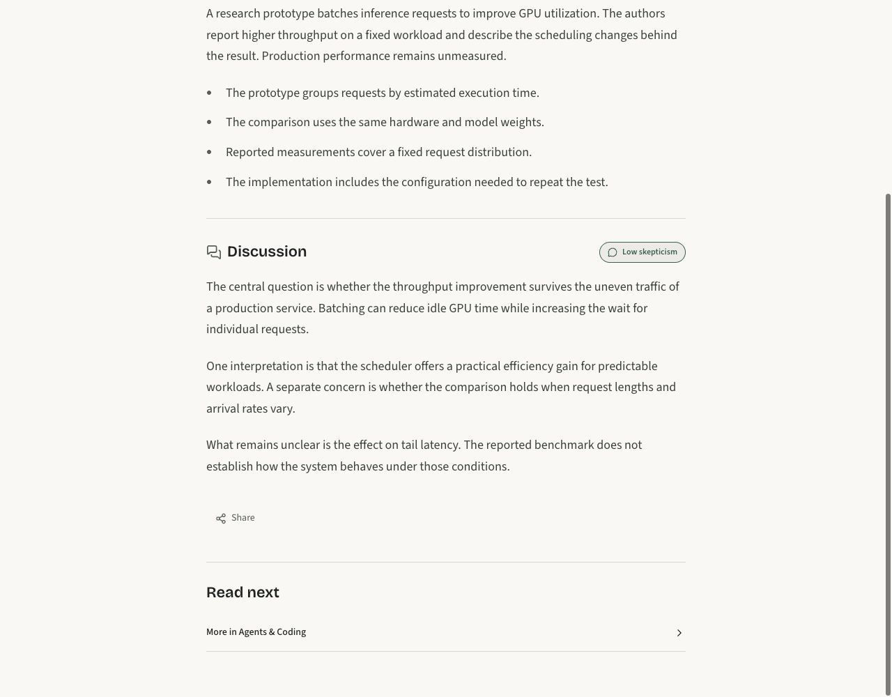
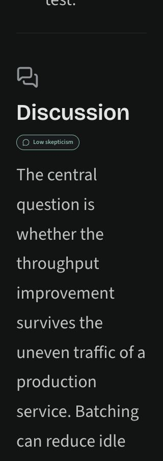

# Summary paragraph rendering

The actual `StoryContent` component was rendered with synthetic editorial copy,
the repository stylesheet, and bundled fonts. This checks presentation, not model
writing quality. No live stories or database were used.

At 320px and 1280px, in light and dark themes and at 100% and 200% text size,
all three Discussion paragraphs remained separate and the document had no
horizontal overflow. Existing links and controls remain unchanged. Component tests
cover legacy/current summaries, missing comments, pending states and escaped HTML.

Browser inspection used the Codex in-app browser after browser-use could not connect
to Chrome. This static preview does not exercise hydration or share interactions.

## Desktop, light theme

## Mobile, dark theme, 200% text

