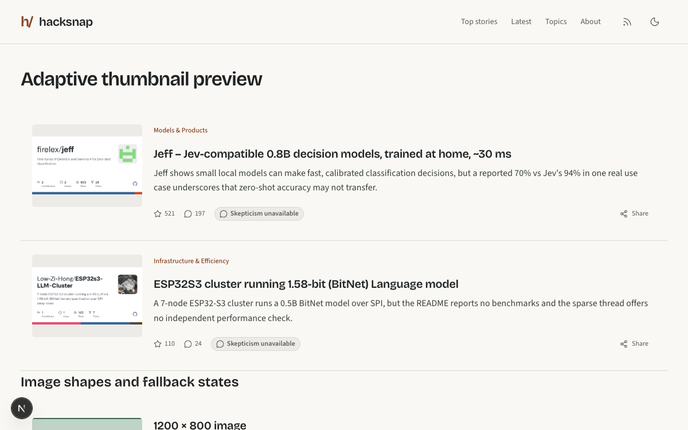
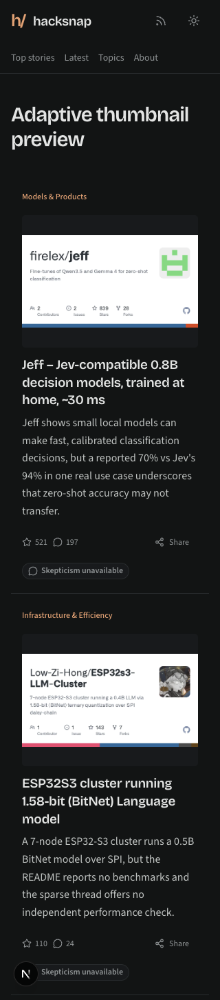

# Adaptive thumbnail fitting

Feed images fill their frame when at least 80% of the source area remains visible.
Otherwise the full image fits against the existing neutral background. Initial
HTML uses the default 4:3 frame; ResizeObserver follows the actual image box when
mobile height caps or text size change its proportions. No additional image or
inference requests are made. Story detail and social previews keep their existing
behavior.

## Verification

- Node 22: clean dependency install, lint, formatting, all 207 tests, typecheck,
  and production build passed without database credentials.
- Browser checks used a temporary local route with the actual public Jeff and
  ESP32S3 images from the reported examples and the shared StoryRow/ArticleImage
  components. The preview route was removed after checking.
- Inspected 320px, 600px and 1200px widths, light/dark themes, and 100%/200% root
  text size. The two wide previews fit fully in 4:3 frames. At 600px, the mobile
  height cap makes the frame wide enough to fill with less than 20% cropping;
  resizing updates the fit correctly.
- Checked portrait, square and 3:2 fixtures, pending images, and broken-image
  placeholders. Existing frame dimensions are retained. Initial server output
  preserves the wide previews with JavaScript disabled at desktop size.
- Images remain decorative and add no keyboard tab stops. Share targets remain
  44px high. Navigation and actions are unchanged.
- Existing limitation: at 320px with 200% text, the pending skepticism label in
  the footer overflows. Reapplying the original cover behavior leaves the same
  overflow. This image-only change does not alter those footer styles.

## Screenshots

The temporary preview uses public API data; unrelated summary fields can differ
from the production feed projection.

