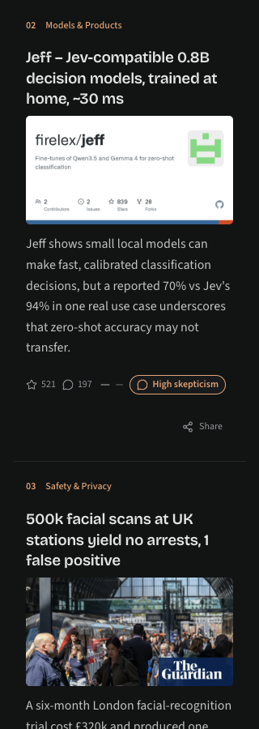
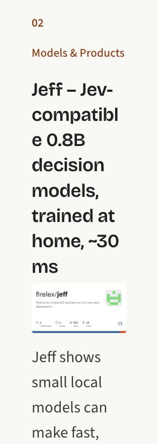

# Compact feed cards

Cards omit discussion themes and the “Read the debate” link. The desktop image
column is wider (30% of available width, capped at 18rem), and images retain their
original aspect ratio at every breakpoint. Complete previews remain visible with
no forced crop or letterbox. Text can make a row taller than its image when needed.

The actual StoryRow and BrowseLayout components were rendered to static HTML with
public feed examples, bundled fonts, and the repository stylesheet. Skepticism
values and ranks are illustrative fixture values. No live database was used.

Browser checks covered full-width and sidebar feeds at 320px, 768px and 1280px,
both light and dark themes, and 100% and 200% root text size. All 24 combinations
had no horizontal overflow, no discussion preview, and footer links/buttons at
least 44px high. Light and dark measurements were identical at each matching
viewport and text size. Headlines remained larger than excerpt text, including
38px headlines and 32px excerpts in the 200% mobile test. Every displayed image
matched its natural aspect ratio within
rounding tolerance. The 1200 by 630px source images displayed at 288 by 151.19px
on desktop and 256 by 134.39px on mobile, with their edges visible. Missing images
and pending copy also rendered without an empty image frame.

Static previews do not exercise hydration, image-error events, or interactive
sharing. The component suite covers image failures and existing navigation/share
behavior; those interactions were not manually retested in the static preview.

Validation: Node 22, lint, format check, all 205 tests in 36 suites, typecheck,
production build, and git diff --check passed. The existing locked dependencies
were installed with npm ci before the initial implementation.

## Normal text size — matching theme comparisons

| Desktop, light, 100% | Desktop, dark, 100% |
| --- | --- |
|  |  |

| Mobile, light, 100% | Mobile, dark, 100% |
| --- | --- |
|  |  |

Accessibility checks: mobile at 200% text size (not the default appearance)

The following previews enlarge root text to 200% at a narrow 320px viewport.
Both themes use the same enlarged layout and require additional vertical scrolling.

| Mobile, light, 200% | Mobile, dark, 200% |
| --- | --- |
|  |  |

