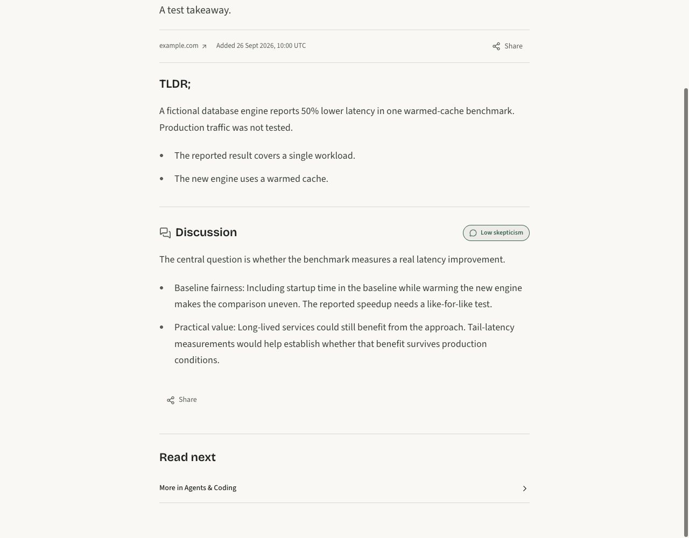
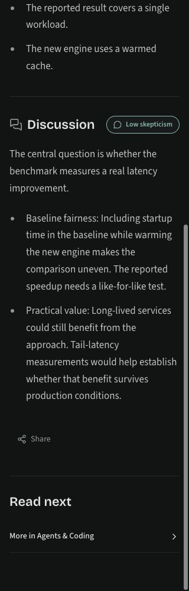

# Discussion bullets validation

The story component was rendered locally with fictional copy, the repository CSS
and bundled fonts. At 320px and 1280px, in light/dark themes and at 100%/200% text,
the opening and two list items remained distinct with no horizontal overflow.
The accessibility tree exposed an actual list. Existing prose, missing discussion,
pending summaries and HTML escaping are covered by component tests. These static
browser checks do not exercise hydration or share interactions.

One live request to the documented DeepSeek V4.1 Flash Modal endpoint used a newly
authored fictional engine benchmark and two synthetic comments. The new structured
schema completed, passed source validation and produced an opening plus two bullets.
No production data was read or changed. See [model output](model-smoke.json).
This is a small compatibility check, not a broad editorial-quality evaluation.

## Desktop, light theme

## Mobile, dark theme

