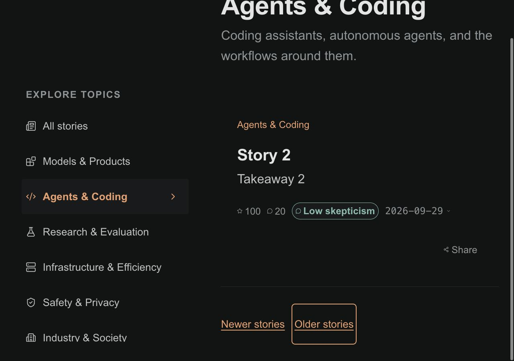
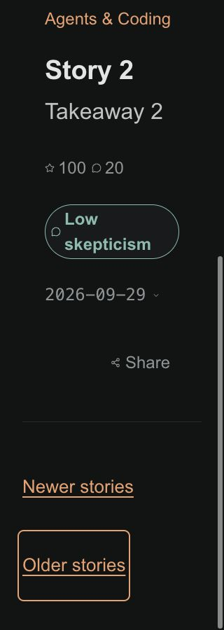

# Category SEO and crawlable pagination checks

The category metadata has dedicated, stable copy for all six topics. Search,
Open Graph, and Twitter descriptions agree; page numbers and canonical URLs
remain specific to each requested page. Article excerpts remain visible HTML.

Category and archive feeds now render an ordinary Older stories link before
hydration. It advances with the loaded feed and disappears at the final page.
The existing Newer stories destination remains relative to the requested page.
The ranked homepage keeps its existing cursor navigation behavior.

## Validation

- Node.js 22.23.3: npm ci, lint, format check, Jest, typecheck, production build.
- Server-render tests cover first, intermediate, final, and page-100 category,
  archive, and dated-archive pages without JavaScript.
- Interaction tests cover automatic loading, focus cancellation on the actual
  Older stories link, retry, duplicate-only batches, and history restoration.
- Metadata route tests cover all six categories, page-two canonical/title/copy,
  invalid routes, social metadata parity, and no story data read.
- Browser inspection used static fixtures rendered from the real StoryFeed and
  BrowseLayout components with the repository CSS, synthetic stories, and Arial
  fallback fonts. No live database, production data, or hydration was involved.
- At 320px and 1280px, light/dark, and 100%/200% root text size, pagination stayed
  within the viewport. Link heights were 44px and 88px respectively.
- Verified keyboard focus, ordinary Older stories navigation, last-page removal,
  and browser Back/Forward on the no-JavaScript category fixture. Hydrated loading
  and history behavior are covered by the component tests rather than this fixture.

