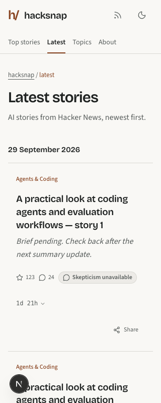
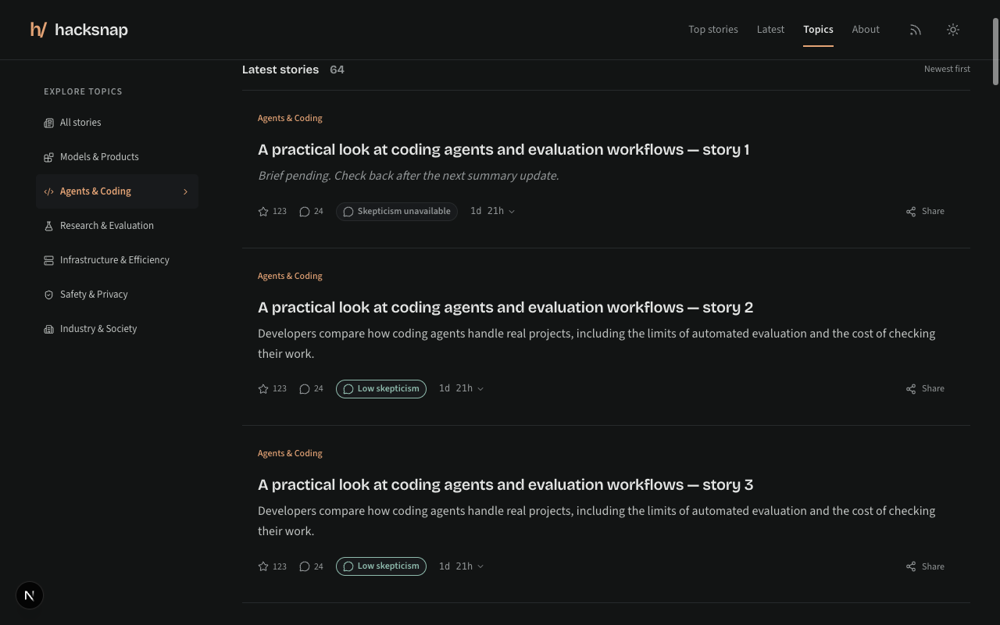
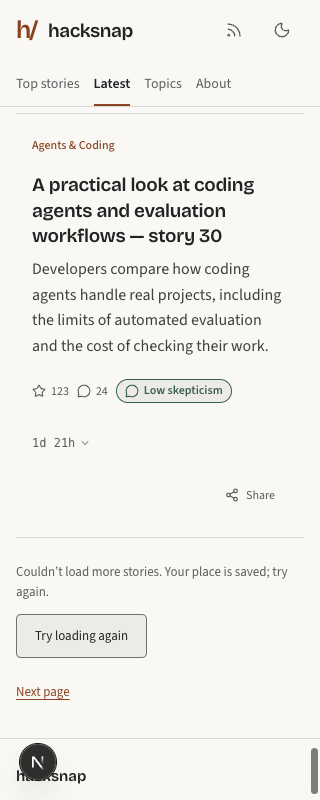
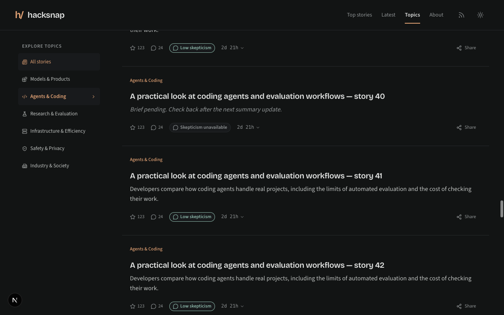

# Shared listing feed verification

Browser checks used local fixture data (64 stories, including pending briefs),
with the production StoryFeed, StoryRow, layout, and navigation components.
Temporary server data adapters and a minimal story-return page were removed
before the final build. No live database or production deployment was tested.

- Latest and topic feeds: 320px and 1280px, light and dark, normal and 200% root
  text size. No horizontal overflow in any combination; headings and cards wrap.
- Scrolling near the bottom appends 30 more stories. Latest combines the shared
  day across batches and adds exactly one heading for the next day.
- Simulated HTTP 503 retains existing rows, shows retry feedback, and exposes a
  44px retry button. Retrying loads the next batch; the final four rows produce
  an end-of-feed message and remove continuation controls.
- Opening topic story 41 after loading 60 stories and using its return link
  restores 60 rows, scrollY 8666, and focus on story 41. Browser back/forward also
  preserves the loaded topic list.
- Component tests cover continuation focus, automatic-request cancellation,
  manual retry, end states, deduplication, and restoration without session storage.
  API tests cover every topic, month filters, pending briefs, malformed queries,
  bounded page validation, and sanitized failures.

[Viewport results](results.json)

After integrating the homepage resume changes from main, all 268 tests passed.
Repeated browser smoke checks confirmed 30-to-60 row loading on Latest/topics
and browser Back restoring topic story 41 with 60 rows, its focus, and scrollY 7809
at the browser’s default desktop viewport.
