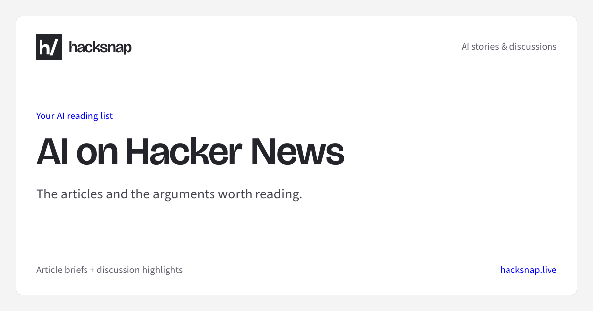

# Brand asset verification

The favicon and default social preview follow the frontend introduced in #236.
The square white-on-charcoal `h/` preserves the header identity. The light gray
canvas and white card match the reading surface; blue identifies source and domain.
Bricolage Grotesque carries headlines and Source Sans 3 carries supporting copy,
matching the feed. Card padding separates the headline from the brand and footer.

Design dials: ENERGY 1 / RHYTHM 1 / MOTION 1. These are static reading assets.

## Validation

- PASS: `npm ci`, lint, format check, all 398 tests across 74 suites, typecheck,
  and production build on Node 22.23.3 without database credentials.
- PASS: production requests to `/favicon.ico`, `/icon.svg`, `/icon.png`,
  `/apple-icon.png`, and `/opengraph-image` return 200 with the expected MIME types.
- PASS: server-rendered `/about` metadata references the generated icons and the
  1200 by 630 Open Graph image, including the existing Twitter image fallback.
- PASS: actual image renders for default, story, long-title/long-excerpt, and
  Unicode stress inputs remain 1200 by 630. Headlines and excerpts remain bounded.
  Story and stress inputs are verification fixtures, not published content.
- PASS: ICO directory and PNG payloads agree at 16, 32, 48, and 96 pixels.
  The SVG also generates the 96px PNG and 180px Apple icon.

## Design checks

- Hard gates PASS: authorized asset update; existing product copy; no invented
  claims or interactive controls. All text contrast on white exceeds 4.5:1:
  charcoal 15.42:1, muted 6.01:1, prose 9.18:1, blue 8.59:1. Rendered images and
  production metadata routes were inspected. Layout controls, navigation,
  loading states, and responsive page behavior are unchanged.
- Purpose checks PASS: colors, typefaces, mark, card, and spacing each follow the
  existing frontend for the reasons above. No texture, glow, shadow, animation,
  decorative badge, or decorative status indicator was introduced.
- Liveliness PASS: headline is the focal point, the square mark identifies the
  brand, and source/domain accents use the site's blue. The fixed composition
  and lack of motion match the declared reading-asset dials.
- Craftsmanship and consistency PASS: local fonts only, deterministic icons from
  one SVG, measured contrast, bounded text, and a working production build.

Stored article images retain their existing priority over the fallback brand card.
No metadata selection logic, page layout, or production deployment was changed.
